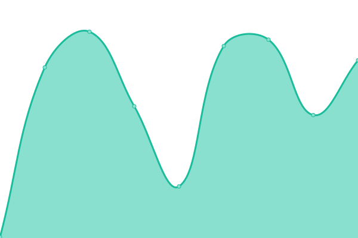
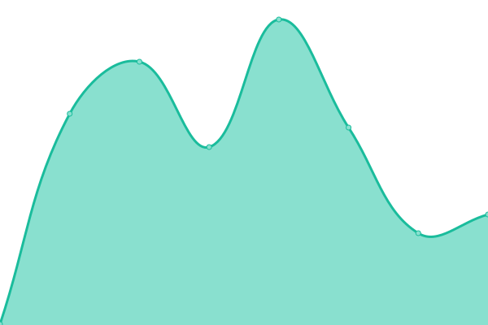
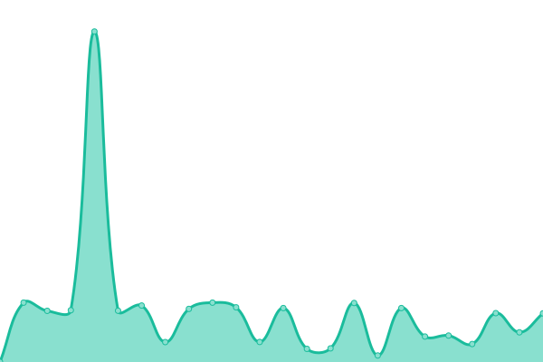

# [📈 Live Status](https://demo.upptime.js.org): <!--live status--> **🟧 Partial outage**

This repository contains the open-source uptime monitor and status page for [Rikka](https://demo.upptime.js.org), powered by [Upptime](https://github.com/upptime/upptime).

With [Upptime](https://upptime.js.org), you can get your own unlimited and free uptime monitor and status page, powered entirely by a GitHub repository. We use [Issues](https://github.com/RikkaLzw/upptime_page/issues) as incident reports, [Actions](https://github.com/RikkaLzw/upptime_page/actions) as uptime monitors, and [Pages](https://demo.upptime.js.org) for the status page.

<!--start: status pages-->
<!-- This summary is generated by Upptime (https://github.com/upptime/upptime) -->
<!-- Do not edit this manually, your changes will be overwritten -->
<!-- prettier-ignore -->
| URL | Status | History | Response Time | Uptime |
| --- | ------ | ------- | ------------- | ------ |
|  [LeeupTV](https://tv.leeup.net) | 🟩 Up | [leeup-tv.yml](https://github.com/RikkaLzw/upptime_page/commits/HEAD/history/leeup-tv.yml) | 

 258ms
     
 | 

<a href="https://demo.upptime.js.org/history/leeup-tv">100.00%</a>
    

|  [LeeupAPI](https://api.leeup.net) | 🟩 Up | [leeup-api.yml](https://github.com/RikkaLzw/upptime_page/commits/HEAD/history/leeup-api.yml) | 

 193ms
     
 | 

<a href="https://demo.upptime.js.org/history/leeup-api">100.00%</a>
    

|  [Leeup Service Uptime](https://uptime.leeup.net) | 🟩 Up | [leeup-service-uptime.yml](https://github.com/RikkaLzw/upptime_page/commits/HEAD/history/leeup-service-uptime.yml) | 

 239ms
     
 | 

<a href="https://demo.upptime.js.org/history/leeup-service-uptime">100.00%</a>
    

|  [Leeup Monitor](https://tz.leeup.net) | 🟥 Down | [leeup-monitor.yml](https://github.com/RikkaLzw/upptime_page/commits/HEAD/history/leeup-monitor.yml) | 

 318ms
     
 | 

<a href="https://demo.upptime.js.org/history/leeup-monitor">99.99%</a>
    

|  [Leeup Blog](https://blog.leeup.net) | 🟥 Down | [leeup-blog.yml](https://github.com/RikkaLzw/upptime_page/commits/HEAD/history/leeup-blog.yml) | 

 0ms
     
 | 

<a href="https://demo.upptime.js.org/history/leeup-blog">0.00%</a>
    

<!--end: status pages-->

[**Visit our status website →**](https://demo.upptime.js.org)

## 📄 License

- Powered by: [Upptime](https://github.com/upptime/upptime)
- Code: [MIT](./LICENSE) © [Anand Chowdhary](https://anandchowdhary.com), supported by [Pabio](https://pabio.com)
- Data in the `./history` directory: [Open Database License](https://opendatacommons.org/licenses/odbl/1-0/)
